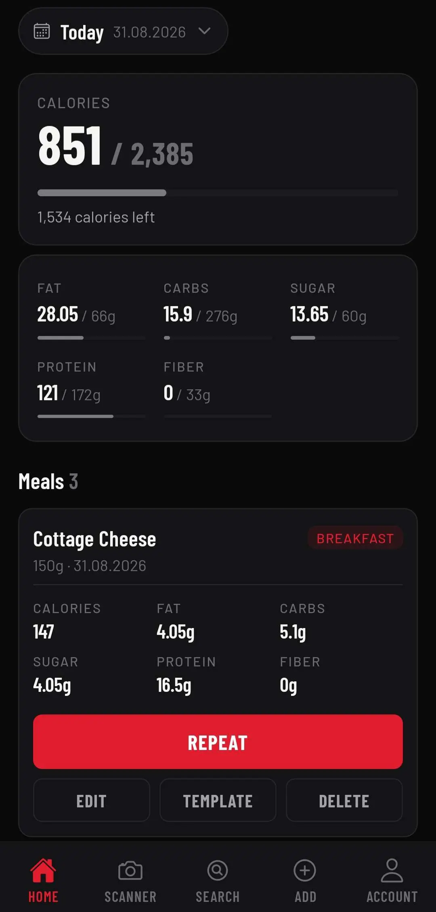
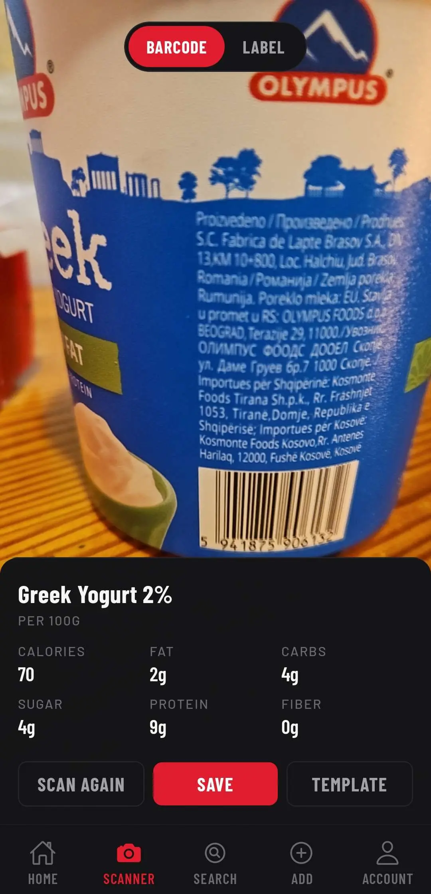
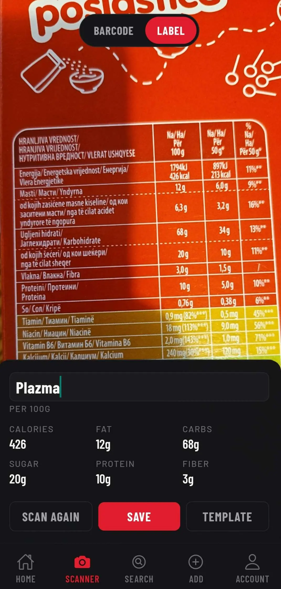
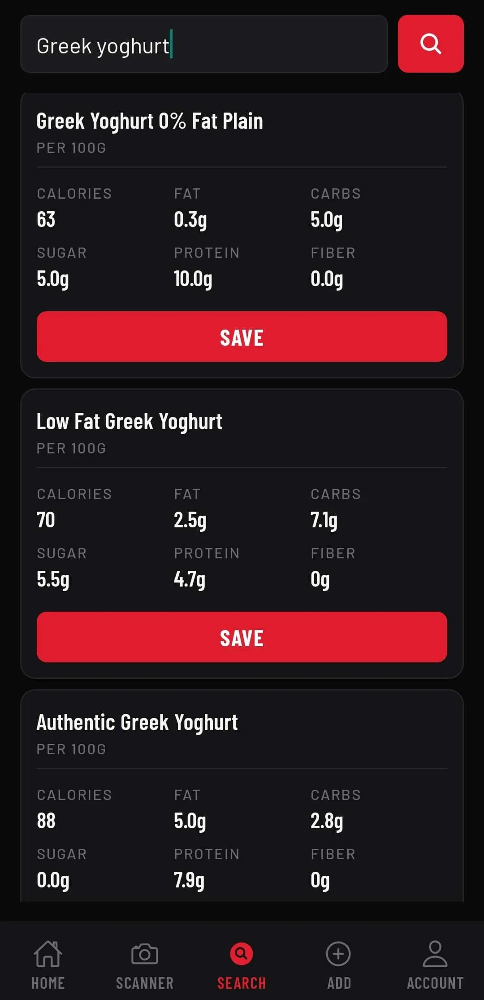
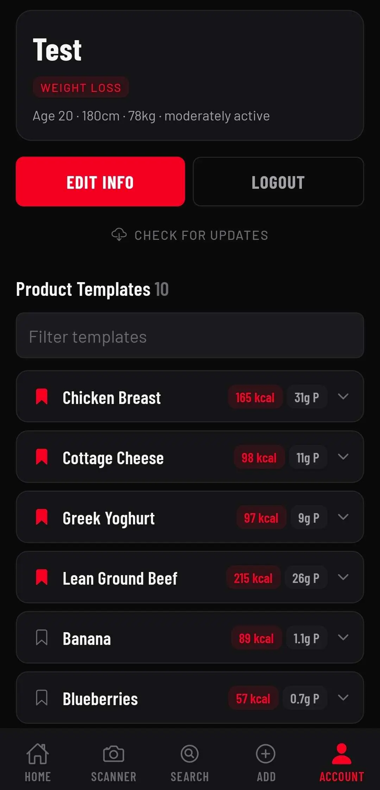

# Nutrition-Track

A mobile app for tracking daily nutrition, built with React Native and Expo. Log meals by scanning a barcode, photographing a nutrition label, searching a product database, or typing values in by hand and then track them against daily targets calculated from your own profile.

All data is stored locally on the device in SQLite.

## Screenshots

|                                                                      |                                                                          |                                                                    |
| :------------------------------------------------------------------: | :----------------------------------------------------------------------: | :----------------------------------------------------------------: |
|      |          |    |
| **Home** - the day's totals and progress against personalised targets |     **Barcode scan** - a product matched against OpenFoodFacts            | **Label scan** - macros read straight off the nutrition table by AI |

|                                                                      |                                                                          |
| :------------------------------------------------------------------: | :----------------------------------------------------------------------: |
|      |          |
|      **Search** - find a product by name when there's no barcode      |    **Templates** - pinned favourites for one-tap logging of regulars      |

## Features

### Logging

- **Barcode scanner** - scan a product barcode to pull nutrition data from OpenFoodFacts, falling back to your own saved products when a barcode isn't in their database.
- **AI nutrition label scanning** - photograph the nutrition table on any package and have the values read straight into the form. Works in any language, handles labels printed as a table or as a run-on sentence, and converts per-serving values to per 100 g. Useful for the many products whose barcodes aren't in OpenFoodFacts.
- **Product search** - search OpenFoodFacts by name. Results without usable macro data are hidden, and duplicates are removed.
- **Manual entry** - add a meal or a product by hand, with macros scaled automatically from per-100 g values to the quantity eaten.

### Tracking

- **Daily overview** - calories, fat, carbohydrates, sugar, protein, and fiber for the selected day, with colour-coded progress against your targets.
- **Personalised targets** - daily allowances calculated from your profile using the Mifflin-St Jeor equation, adjusted for activity level and goal.
- **Date navigation** - jump to any past day to review or edit what was logged.
- **Edit, repeat, and delete** - change the quantity of a logged meal and have its macros rescale, log a previous meal again on any date, or remove it.

### Templates

- **Save any product as a template** - from the scanner, the search screen, or manual entry.
- **Pin your regulars** - keep them at the top of the list; everything else is sorted alphabetically.
- **Filter box** - appears once you have more than five templates, so a long list stays usable.
- **Edit or delete** - a template, or log it as a meal with a chosen quantity, date, and meal type.

### Account

- Local account creation and login, with the session persisted between launches.
- Edit profile details (age, height, weight, activity level, goal) to recalculate targets.
- Check for updates from inside the app.

## Tech stack

|              |                                                                                                                                           |
| ------------ | ----------------------------------------------------------------------------------------------------------------------------------------- |
| Framework    | [React Native](https://reactnative.dev/) 0.76, [Expo](https://expo.dev/) SDK 52                                                           |
| Language     | TypeScript                                                                                                                                |
| Routing      | [Expo Router](https://docs.expo.dev/router/introduction/) (file-based)                                                                    |
| Database     | [SQLite](https://www.sqlite.org/) via `expo-sqlite`, with schema migration on launch and an automatic backup when the app version changes |
| Server state | [TanStack Query](https://tanstack.com/query/latest)                                                                                       |
| Validation   | [Zod](https://zod.dev/)                                                                                                                   |
| Camera       | [React Native Vision Camera](https://react-native-vision-camera.com/)                                                                     |
| AI           | [Gemini API](https://ai.google.dev/) (`gemini-3.5-flash`) for nutrition label reading                                                     |
| Product data | [OpenFoodFacts API](https://world.openfoodfacts.org/)                                                                                     |
| Distribution | EAS Build and EAS Update (OTA)                                                                                                            |

## Getting started

### Prerequisites

- Node.js and npm
- An [Expo](https://expo.dev/) account for cloud builds
- A [Gemini API key](https://aistudio.google.com/apikey) for label scanning

### Install

```bash
npm install
```

### Configure the API key

Create a `.env` file in the project root:

```
GEMINI_API_KEY=your-key-here
```

`.env` is gitignored. The key is read at runtime through `Constants.expoConfig.extra.geminiApiKey`, wired up in `app.config.js`.

For cloud builds and OTA updates, register the key with EAS as well:

```bash
npx eas env:set --scope project \
  --environment development --environment preview --environment production \
  --name GEMINI_API_KEY --visibility sensitive --type string \
  --value "your-key-here"
```

### Run

Label scanning and barcode scanning both need native modules, so they require a development build rather than Expo Go:

```bash
npx eas build --profile development --platform android
npm start
```

## Building and deploying

```bash
# Build an installable APK
npx eas build --profile preview --platform android

# Push a JavaScript-only update over the air
npx eas update --channel preview --environment preview --message "description"
```

The `--environment` flag is required for the API key to resolve. Any change involving a new native module or a config plugin needs a full build, not an update.

Users pull updates with **Check for Updates** on the Account screen.

## Notes and limitations

- **Gemini free tier allows 20 label scans per day** per project. Attaching billing removes the cap and also stops Google using submitted images for product improvement.
- **Android-focused.** The date picker uses `DateTimePickerAndroid` directly, so the iOS path is untested.
